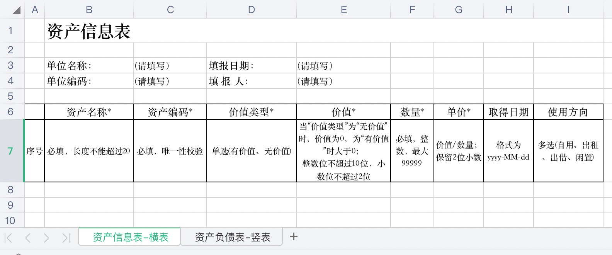
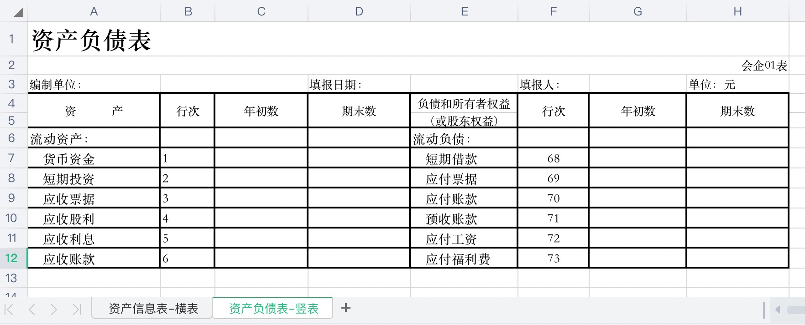
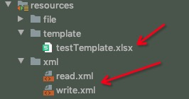

## excel导入导出工具-edata

### 简介
&emsp; &emsp; edata是一个轻量级的excel数据处理工具，使用简单，利用xml解析时的顺序特性，动态计算单元格坐标，避免硬编码，使得后期维护非常方便。

#### 优点
&emsp; &emsp; 1、导入功能采用POI的事件驱动模式解析Excel，只解析数据，忽略样式，因此非常高效，且占用内存资源少；

&emsp; &emsp; 2、数据校验格式丰富：内置日期、数字、长度、正则、必填、必空、唯一性、表达式、选项等数据格式校验，同时也支持自定义数据校验；

&emsp; &emsp; 3、导入支持跨sheet联动校验；

&emsp; &emsp; 4、edata使用了大量的缺省配置以及坐标自动计算，配置极为简单、易读，让开发人员更加专注于业务本身；

&emsp; &emsp; 5、支持横表、竖表（横表表示一行数据表示一个数据对象，竖表表示整张表为一个数据对象）的导入导出；

&emsp; &emsp; 6、兼容xls、xlsx；支持Excel数据的快速导入导出；

&emsp; &emsp; 7、导出的xml配置可以复用导入的配置。

#### 缺点
&emsp; &emsp; 1、导出的Excel无法自定义丰富的样式，默认样式为边框+居中，无模版导出列宽度自适应。这些默认样式，用户无法修改。

&emsp; &emsp; 2、横表导入，默认body里的所有数据无类型差异，每一行为一个数据对象（无差异的数据对象），无法验证类似最后一行为前面的加总等校验。
通俗来讲就是body以下，不能有模板内容。

&emsp; &emsp; 如有疑问或建议，欢迎issue。


### xml配置
##### 1.结构
```xml
<excel> <!-- 根 -->
    <sheet> <!-- sheet表，可以多个 -->
        <header> <!-- 表头，可以1个或没有 -->
            <cell></cell> <!-- 单元格，至少1个 -->
        </header>
        <horizontalBody> <!-- 横表body -->
            <cell>
                <condition> <!-- 条件判断 -->
                    <rule></rule>
                </condition>

                <rule></rule> <!-- 校验规则 -->
            </cell>
        </horizontalBody>
        <valueFilter/> <!-- 数据过滤器 -->
        <templateFilter/> <!-- 模板过滤器 -->
    </sheet>

    <sheet>
        <header></header>
        <verticalBody> <!-- 竖表body -->
            <cell></cell>
            <rectangle> <!-- 矩形区域，用于坐标自动计算 -->
                <cell></cell>
            </rectangle>
        </verticalBody>
    </sheet>
    <globalFilter/> <!-- 全局过滤器（数据和模板同时过滤） -->
</excel>
```
#### 2.元素
| 元素	| 名称	|父元素	|子元素	|是否必须|
| ------ | ------ | ------ | ------ | ------ |
|excel	|根	|无	|sheet、globalFilter	|唯一|
|sheet	|sheet页	|excel	|header、horizontalBody、 verticalBody、valueFilter、 templateFilter	|至少1个|
|header	|表头	|sheet	|cell	|1个或没有|
|horizontalBody	|横表body (表示采用横表规则解析）	|sheet	|cell	|横表必须，且唯一|
|verticalBody	|竖表body（表示采用竖表规则解析）|	sheet|	cell、rectangle|	竖表必须且唯一|
|cell	|数据单元格|	header、horizontalBody、 viticalBody、rectangle|	rule、condition|	至少1个|
|condition	|条件分支	|cell	|rule|	非必须，可以多个|
|rule	|校验规则（指定校验器）	|cell、condition|	无|	非必须，可以多个|
|rectangle	|矩形|	verticalBody|	cell|	非必须，可以多个|
|globalFilter|	全局过滤期（作用于所有的sheet的模板和数据）|	excel|	无|	1个或没有|
|valueFilter|	数据过滤器|	sheet|	无|	1个或没有|
|templateFilter|	模板过滤器|	sheet|	无|	1个或没有|

#### 3.属性
<table>
    <tbody>
        <tr >
            <td >
                <div>
                    元素
                </div>
            </td>
            <td >
                <div>
                    属性
                </div>
            </td>
            <td >
                <div>
                    释义
                </div>
            </td>
            <td >
                取值范围
            </td>
            <td >
                默认值
            </td>
        </tr>
        <tr >
            <td rowspan="2">
                <div >
                    excel
                </div>
            </td>
            <td >
                 checkTemplate
            </td>
            <td >
                <div>
                    <span >是否校验模板</span><br />
                </div>
            </td>
            <td >
                <div>
                    true、false
                </div>
            </td>
            <td >
                <div>
                    true
                </div>
            </td>
        </tr>
        <tr >
            <td >
                <div >
                    checkSheetSequence
                </div>
                <div >
                    <br />
                </div>
            </td>
            <td >
                <span >是否校验sheet顺序</span><br />
            </td>
            <td >
                <div>
                    true、false<br />
                </div>
            </td>
            <td >
                <div>
                    false
                </div>
            </td>
        </tr>
        <tr >
            <td rowspan="2">
                sheet
            </td>
            <td >
                sheetName
            </td>
            <td >
                表名，用于xml配置与excel数据对应，<b>必填</b> 
            </td>
            <td ></td>
            <td >
                <br />
            </td>
        </tr>
        <tr >
            <td >
                sheetCode
            </td>
            <td >
                表唯一code，<b>必填</b> 
            </td>
            <td >
                <div>
                    <br />
                </div>
            </td>
            <td >
                <br />
            </td>
        </tr>
        <tr >
            <td >
                horizontalBody<br />
            </td>
            <td >
                firstValuePosition
            </td>
            <td >
                <div>
                    第一个数据单元格位置（如：C3），<b>必填</b> 
                </div>
            </td>
            <td >
                <br />
            </td>
            <td >
                <br />
            </td>
        </tr>
        <tr >
            <td  rowspan="13">
                cell<br />
            </td>
            <td >
                position
            </td>
            <td >
                <div>
                    位置（如：B4），推荐写法
                </div>
            </td>
            <td >
                <br />
            </td>
            <td >
                <br />
            </td>
        </tr>
        <tr >
            <td >
                rowIndex
            </td>
            <td >
                位置行号（绝对行号，横表的body里无效）
            </td>
            <td >
                <br />
            </td>
            <td >
                <br />
            </td>
        </tr>
        <tr >
            <td >
                colIndex
            </td>
            <td >
                <div>
                    位置列号（绝对列号）
                </div>
            </td>
            <td >
            </td>
            <td >
            </td>
        </tr>
        <tr >
            <td >
                title
            </td>
            <td >
                <div>
                    标题，<b>必填</b> 
                </div>
            </td>
            <td >
                <br />
            </td>
            <td >
                <br />
            </td>
        </tr>
        <tr >
            <td >
                field
            </td>
            <td >
                <div>
                    字段名，<b>必填</b>
                </div>
            </td>
            <td ></td>
            <td ></td>
        </tr>
        <tr>
            <td >
                valType
            </td>
            <td >
                <div>
                    数据类型
                </div>
            </td>
            <td >
                number：数字<br />
                date：日期<br />
                <br />
                缺省则为string
            </td>
            <td >
                <br />
            </td>
        </tr>
        <tr >
            <td >
                format<br />
            </td>
            <td >
                <div>
                    数据格式
                </div>
            </td>
            <td >
                与valType联动:<br /><br />
                number类型的格式为：整数位,小数位&nbsp; &nbsp;如：10,2<br />
                date类型的格式为日期格式，如：yyyy-MM-dd（默认）
            </td>
            <td >
                <br />
            </td>
        </tr>
        <tr >
            <td >
                required<br />
            </td>
            <td >
                <div>
                    该数据是否必填
                </div>
            </td>
            <td >
                true、false
            </td>
            <td >
                true
            </td>
        </tr>
        <tr >
            <td >
                maxLength
            </td>
            <td >
                <div>
                    最大长度（不计算首尾空格）
                </div>
            </td>
            <td >
                <br />
            </td>
            <td >
                <br />
            </td>
        </tr>
        <tr>
            <td >
                unique
            </td>
            <td >
                <div>
                    是否唯一
                </div>
            </td>
            <td >
                true、false
            </td>
            <td >
                false
            </td>
        </tr>
        <tr>
            <td >
                autoSequence
            </td>
            <td >
                导出时，该字段是否自动填充数字序号。
            </td>
            <td >
                true、false
            </td>
            <td >
                false
            </td>
        </tr>
        <tr>
            <td >
                split
            </td>
            <td >
                导入导出时，对于集合类型的间隔符
            </td>
            <td >
            </td>
            <td >
                ,（英文逗号）
            </td>
        </tr>
        <tr>
            <td >
                writeDefault
            </td>
            <td >
                导出时，默认填充的值
            </td>
            <td >
            </td>
            <td >
            </td>
        </tr>
        <tr >
            <td  rowspan="3">
                condition<br />
            </td>
            <td >
                target
            </td>
            <td >
                <div>
                    关联的目标单元格，<b>必填</b>
                </div>
            </td>
            <td >
                格式：${field}
            </td>
            <td >
                <br />
            </td>
        </tr>
        <tr >
            <td >
                values
            </td>
            <td >
                关联目标单元格的取值范围列表（满足条件则执行condition里面的校验）,<b>必填</b>
            </td>
            <td >
                格式：value1,value2,value3
            </td>
            <td >
                <br />
            </td>
        </tr>
        <tr>
            <td >
                errorMsg
            </td>
            <td >
                自定义错误提示
            </td>
            <td >
                <br />
            </td>
            <td >
                校验不通过
            </td>
        </tr>
        <tr>
            <td  rowspan="4">
                rule<br />
            </td>
            <td >
                type
            </td>
            <td >
                <div>
                    校验器类型
                </div>
            </td>
            <td >
                maxLength：最大长度<br />
                required：必填<br />
                selection：单选<br />
                selections：多选<br />
                blank：必空<br />
                regex：正则<br />
                boolean：boolean表达式<br />
                unique：唯一（针对当次导入的该字段的唯一性校验，适用横表）<br />
                custom：自定义<br />
            </td>
            <td >
            </td>
        </tr>
        <tr >
            <td >
                expression
            </td>
            <td >
                表达式
            </td>
            <td >
                <span >与type属性联动：</span><br />
                <br />
                maxLength：大于0的整数<br />
                regex：正则表达式<br />
                boolean：boolean表达式<br />
                custom：自定义校验器类的全类名（需要实现ICustomValidator接口）<br />
            </td>
            <td >
                <br />
            </td>
        </tr>
        <tr >
            <td >
                values
            </td>
            <td >
                给校验器的传值列表
            </td>
            <td >
                <span >与type属性联动：</span><br />
                <br />
                selection：单选的取值范围，形如：value1,value2,value3<br />
                selections：多选的取值范围，同上。<br />
                custom：给自定义校验器的传值列表，形如：${field1},${filed2}<br />
            </td>
            <td >
                <br />
            </td>
        </tr>
        <tr >
            <td>
                errorMsg
            </td>
            <td>
                校验不通过时的提示信息
            </td>
            <td>
                <br />
            </td>
            <td>
                各校验器有默认值
            </td>
        </tr>
        <tr >
            <td  rowspan="2">
                rectangle<br />
            </td>
            <td >
                firstCell
            </td>
            <td >
                第一个单元格位置
            </td>
            <td  rowspan="2">
                形如：C5<br />
                注意：矩形区域包含的cell数量，应与通过firstCell、lastCell计算得出的数量一致
            </td>
            <td  rowspan="2">
                <br />
            </td>
        </tr>
        <tr>
            <td >
                lastCell
            </td>
            <td >
                最后一个单元格位置
            </td>
        </tr>
        <tr >
            <td  rowspan="2">
                globalFilter<br />
            </td>
            <td >
                values
            </td>
            <td >
                不校验的值列表
            </td>
            <td >
                多个值用英文逗号隔开，例如：<br />
                (请输入),(请填写)
            </td>
            <td >
                <br />
            </td>
        </tr>
        <tr >
            <td >
                positions
            </td>
            <td >
                不校验的坐标列表
            </td>
            <td >
                多个坐标用英文逗号隔开
            </td>
            <td >
                <br />
            </td>
        </tr>
        <tr >
            <td >
                valueFilter<br />
            </td>
            <td >
                同上
            </td>
            <td >
                <div>
                    <br />
                </div>
            </td>
            <td >
                <br />
            </td>
            <td >
                <br />
            </td>
        </tr>
        <tr >
            <td >
                templateFilter<br />
            </td>
            <td >
                同上
            </td>
            <td >
                <div>
                    <br />
                </div>
            </td>
            <td >
                <br />
            </td>
            <td >
                <br />
            </td>
        </tr>
    </tbody>
</table>

#### 4.示例
##### 一）横表

###### 1）导入
```xml
<?xml version="1.0" encoding="UTF-8" ?>
<excel xmlns="com/ruochu/edata/read-write.xsd"> <!-- 引入schema -->
    <sheet sheetName="资产信息表-横表" sheetCode="assetInfo">
        <header>
            <cell title="单位名称" field="unitName" position="c3"/>
            <cell title="单位编码" field="unitCode" position="c4"/>
            <cell title="填报日期" field="fillDate" valType="date" position="e3"/>
            <cell title="填报人" field="filler" position="e4"/>
        </header>
        <horizontalBody  firstValuePosition="a8">
            <cell title="序号" field="sequence" autoSequence="true"/>
            <cell title="资产名称" field="assetName" maxLength="20"/>
            <cell title="资产编码" field="assetCode" maxLength="20">
                <rule type="unique"/>
            </cell>
            <cell title="价值类型" field="valueType">
                <rule type="selection" values="有价值,无价值"/>
            </cell>
            <cell title="价值" field="assetValue" valType="number" format="10,2" required="false">
                <condition target="${valueType}" values="有价值">
                    <rule type="required"/>
                </condition>
            </cell>
            <cell title="数量" field="amount" valType="number" format="10,0"/>
            <cell title="单价" field="price" valType="number" format="10,2">
                <rule type="custom" expression="PriceValidator" values="${assetValue},${amount}"/>
            </cell>
            <cell title="取得日期" field="obtainDate" valType="date" format="yyyy-MM-dd" required="false"/>
            <cell title="使用方向" field="useIntention" required="false">
                <rule type="selections" values="自用,出租,出借,闲置"/>
            </cell>
        </horizontalBody>
    </sheet>
    <globalFilter values="(请填写）"/>
</excel>
```
自定义校验器
```java
/**
 * 价格校验器
 */
public class PriceValidator implements ICustomValidator {
    @Override
    public boolean validate(String cellValue, Map<String, String> values) {
        System.out.println("当前单元格的值：" + cellValue);
        System.out.println("传入的值列表：" + values);

        System.out.println("自定义校验逻辑。。。");
        
        // 返回校验结果
        return true;
    }
} 
```
###### 2）导出
```xml
<?xml version="1.0" encoding="UTF-8" ?>
<excel xmlns="com/ruochu/edata/read-write.xsd">
    <sheet sheetName="资产信息表-横表" sheetCode="assetInfo">
        <header>
            <cell title="单位名称" field="unitName" position="c3"/>
            <cell title="单位编码" field="unitCode" position="c4"/>
            <cell title="填报日期" field="fillDate" position="e3"/>
            <cell title="填报人" field="filler" position="e4"/>
        </header>
        <horizontalBody  firstValuePosition="a8">
            <cell title="序号" field="sequence" autoSequence="true"/>
            <cell title="资产名称" field="assetName" />
            <cell title="资产编码" field="assetCode" />
            <cell title="价值类型" field="valueType" />
            <cell title="价值" field="assetValue" />
            <cell title="数量" field="amount" />
            <cell title="单价" field="price" />
            <!-- 默认yyyy-MM-dd 可以像填报日期一样不指定格式-->
            <cell title="取得日期" field="obtainDate" valType="date" format="yyyy-MM-dd" /> 
            <cell title="使用方向" field="useIntention" split="、" />
        </horizontalBody>
    </sheet>
</excel>
```


##### 二）竖表导入导出（只导出时不用指定校验信息）

```xml
<?xml version="1.0" encoding="UTF-8" ?>
<excel xmlns="com/ruochu/edata/read-write.xsd">
    <sheet sheetCode="balanceSheet" sheetName="资产负债表-竖表">
        <header>
            <cell title="编制单位" field="unitName" position="b3"/>
            <cell title="填报日期" field="fillDate" position="e3"/>
            <cell title="填报人" field="filler" position="g3"/>
        </header>
        <verticalBody>
            <rectangle firstCell="C7" lastCell="D12">
                <cell title="货币资金-年初数" field="f1" valType="number" format="10,2"/>
                <cell title="货币资金-期末数" field="f2" valType="number" format="10,2"/>

                <cell title="短期投资-年初数" field="f3" valType="number" format="10,2"/>
                <cell title="短期投资-期末数" field="f4" valType="number" format="10,2"/>

                <cell title="应收票据-年初数" field="f5" valType="number" format="10,2"/>
                <cell title="应收票据-期末数" field="f6" valType="number" format="10,2"/>

                <cell title="应收股利-年初数" field="f7" valType="number" format="10,2"/>
                <cell title="应收股利-期末数" field="f8" valType="number" format="10,2"/>

                <cell title="应收利息-年初数" field="f9" valType="number" format="10,2"/>
                <cell title="应收利息-期末数" field="f10" valType="number" format="10,2"/>

                <cell title="应收账款-年初数" field="f11" valType="number" format="10,2"/>
                <cell title="应收账款-期末数" field="f12" valType="number" format="10,2"/>

            </rectangle>
            <rectangle firstCell="g7" lastCell="H12">
                <cell title="短期借款-年初数" field="f13" valType="number" format="10,2"/>
                <cell title="短期借款-期末数" field="f14" valType="number" format="10,2"/>

                <cell title="应付票据-年初数" field="f15" valType="number" format="10,2"/>
                <cell title="应付票据-期末数" field="f16" valType="number" format="10,2"/>

                <cell title="应付账款-年初数" field="f17" valType="number" format="10,2"/>
                <cell title="应付账款-期末数" field="f18" valType="number" format="10,2"/>

                <cell title="预收账款-年初数" field="f19" valType="number" format="10,2"/>
                <cell title="预收账款-期末数" field="f20" valType="number" format="10,2"/>

                <cell title="应付工资-年初数" field="f21" valType="number" format="10,2"/>
                <cell title="应付工资-期末数" field="f22" valType="number" format="10,2"/>

                <cell title="应付福利费-年初数" field="f23" valType="number" format="10,2"/>
                <cell title="应付福利费-期末数" field="f24" valType="number" format="10,2"/>
            </rectangle>
        </verticalBody>
    </sheet>
</excel>
```

### 代码
#### 1.引入依赖
```xml

```

#### 2.将Excel模板和xml放到工程里


#### 3.导入
```java
public class ReadTest {
    @Test
    public void testRead() throws IOException, UnknownFileTypeException {
        // excel模板
        String templateExcelUrl = "template/testTemplate.xlsx";
        // xml配置
        String xmlPath = "xml/read.xml";
        
        // 模拟用户导入excel
        String userExcelPath = getClass().getClassLoader().getResource("file/test.xlsx").getPath();
        
        // 获取导入服务
        ReadService readService = EdataFactory.getReadService(templateExcelUrl, xmlPath);
        // 执行导入，得到导入结果
        ReadResult readResult = readService.read(userExcelPath);

        System.out.println("校验是否通过：" + readResult.isSuccess());
    }
}
```

#### 4.导出
```java
public class WriteTest {

    /**
     * 无模板导出
     */
    @Test
    public void testWrite4NoneTemplate() throws IOException {
        // mock需要导出的数据
        int dataSize = 1000;
        List<AssetModel> list = new ArrayList<>(dataSize);
        for (int i = 0; i < dataSize; i++) {
            list.add(mockAssetModel());
        }

        String xmlPath = "xml/write.xml";
        String sheetCode = "assetInfo";
        OutputStream outputStream = new FileOutputStream(new File("xxx/asset.xlsx"));
        
        EdataFactory.getWriteService(xmlPath) // 获得导出服务
                .addBodyData(sheetCode, list) // 添加数据
                .writeWithNoneTemplate(outputStream); // 执行导出
    }

    /**
     * 有模板导出
     */
    @Test
    public void testWrite() throws IOException {
        // mock需要导出的数据
        int dataSize = 100;
        List<AssetModel> list = new ArrayList<>(dataSize);
        for (int i = 0; i < dataSize; i++) {
            list.add(mockAssetModel());
        }

        String xmlPath = "xml/write.xml";
        String templateExcelPath = "template/testTemplate.xlsx";
        String sheetCode = "assetInfo";
        OutputStream outputStream = new FileOutputStream(new File("xxx/asset2.xlsx"));
        
        EdataFactory.getWriteService(xmlPath)
                .addBodyData(sheetCode, list)
                .write(templateExcelPath, outputStream);
    }
}
```